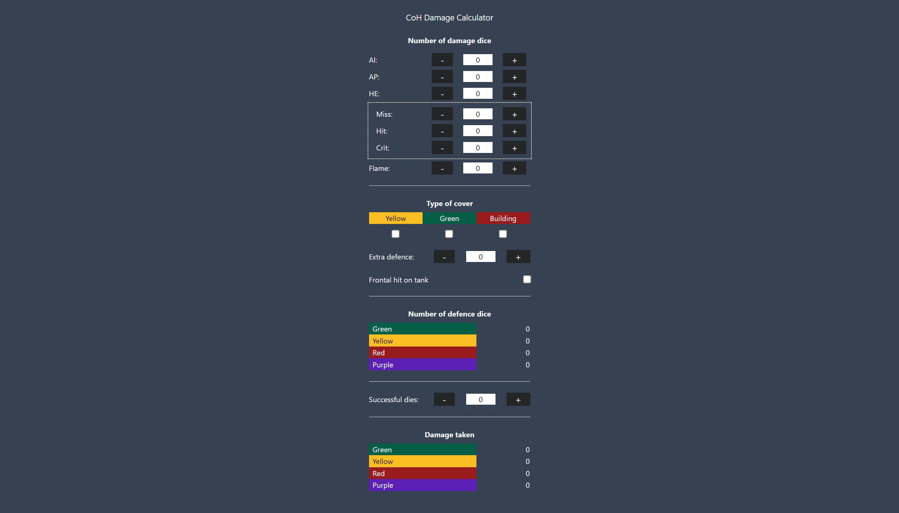

# Company of Heroes Damage Calculator

This is a simple JavaScript calculator, built for the [Company of Heroes board game](https://www.kickstarter.com/projects/223137030/company-of-heroes-board-game/description) developed by Bad Crow Games. Its purpose is to save you from having to reference the lookup table and calculating the damage dice yourself. It's based on the Excel spreadsheet by Jan-Hendrik Meier but adapted for phones and hence the narrow design.

The calculator supports both the original Kickstarter beginner rules as well as the 2.0 rules. When playing the beginner rules, you can calculate damage just by entering a High Explosive (HE) value. When playing by the 2.0 rules, you'll instead enter your numbers into the white rectangle (miss, hit, crit) and the calculator will automatically disregard the HE value above.
